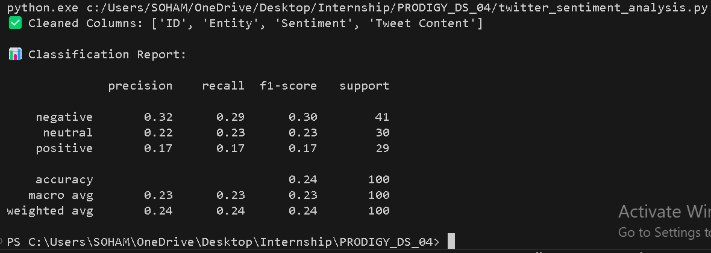

# PRODIGY_DS_04
# 🐦 Twitter Sentiment Analysis 🚀

This project performs sentiment analysis on tweets using Natural Language Processing (NLP) and machine learning techniques. It classifies tweets as **Positive**, **Negative**, or **Neutral**, and visualizes the distribution of sentiments using matplotlib.

---

## 📂 Dataset
The dataset used is a custom CSV file (`twitter_sentiment_500.csv`) containing 500 synthetic tweets with sentiment labels.

Columns in the dataset:
- `ID`
- `Entity`
- `Sentiment`
- `Tweet Content`

---

## ✨ Features

- ✅ Clean and preprocess tweet data
- 🧠 Train a Naive Bayes classifier
- 📈 Visualize sentiment distribution using bar plots
- 📃 Display classification metrics (precision, recall, f1-score)

---

## 🧪 Example Output

**Classification Report (sample)**  

**Sentiment Distribution Plot**  

